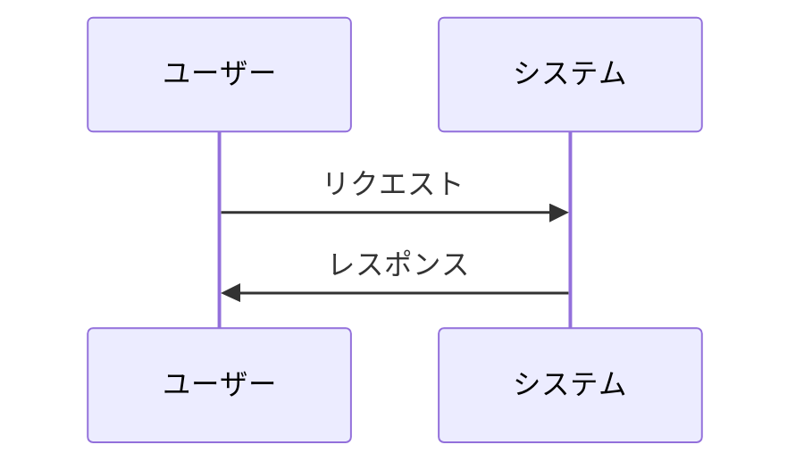

# Update Docs

`.docs/` の仕様書をコードと同期して更新する。

## ワークフロー

### ステップ1: 変更対象の特定

PRの差分から更新対象を特定する。

```bash
git diff main...HEAD --name-only
```

### ステップ2: コード探索

Explore エージェントで変更されたコードを調査する。

### ステップ3: 仕様書の更新

変更内容を該当する `.docs/` ファイルに反映する。

更新前に AskUserQuestion でユーザーに確認する。

### ステップ4: CLAUDE.md の更新

`.docs/` の構成が変更された場合、CLAUDE.md の `## Docs` セクションを更新する。

## ディレクトリ構造

### 全体構成

```
.docs/
├── overview.md          # 製品全体像と連携
├── architecture.md      # システム設計概要 (API、BaaS連携、データ配置)
├── glossary.md          # 用語集
├── notes/               # 補足情報 (外部連携設定、データフォーマット)
└── products/            # 製品仕様
    ├── shop/            # ECサイト
    └── console/         # 管理画面
```

### 製品ディレクトリ (フラット構造)

各製品はフラットな構造を採用する。

```
products/shop/
├── overview.md          # 製品概要
├── architecture.md      # 技術構成
├── database.md          # データベース設計 (詳細)
├── personas.md          # ペルソナ
├── stories/             # ユーザーストーリー
├── actors.md            # アクター定義
├── relationships.md     # エンティティ関係
├── api.md               # API仕様
├── sitemap.md           # サイトマップ
├── models/              # ドメインモデル
├── services/            # サービス仕様
├── policies/            # ポリシー・権限
├── integrations/        # 外部連携
├── pages/               # ページ仕様
└── features/            # 機能仕様
```

### ファイル配置ルール

- 単一ファイルで収まる仕様 → ルートに `.md` ファイル
- 複数ファイルが必要な仕様 → ディレクトリを作成

## CLAUDE.md の Docs セクション

`.docs/` のディレクトリ構成と読み方を CLAUDE.md に記載する。

### 構成パターンの判定

```bash
ls .docs/
```

パターン:

- `products/` がある → 複数製品パターン
- `product/` がある → 単一製品パターン
- どちらもない → シンプルパターン

### 複数製品パターン (products/)

```markdown
## Docs

`.docs/` にプロジェクトの仕様書がある。

構成:

- `glossary.md` - 用語集
- `products/` - 製品仕様
  - `shop/` - ECサイト (このリポジトリ)
  - `console/` - 管理画面

各製品はフラット構造:

- `overview.md` - 製品概要
- `architecture.md` - 技術構成
- `personas.md` - ペルソナ
- `stories/` - ユーザーストーリー
- `pages/` - ページ仕様
- `features/` - 機能仕様

読み方:

- 用語の確認 → `glossary.md`
- 技術構成 → `products/shop/architecture.md`
- ペルソナ → `products/shop/personas.md`
- 画面仕様 → `products/shop/pages/`
- 機能仕様 → `products/shop/features/`
```

### 単一製品パターン (product/)

```markdown
## Docs

`.docs/` にプロジェクトの仕様書がある。

構成:

- `glossary.md` - 用語集
- `product/` - 製品仕様

読み方:

- 用語の確認 → `glossary.md`
- 技術構成 → `product/architecture.md`
- ペルソナ → `product/personas.md`
- 画面仕様 → `product/pages/`
- 機能仕様 → `product/features/`
```

### 更新タイミング

- `.docs/` のディレクトリ構成が変更された時
- 新しいカテゴリが追加された時
- 製品の対応関係が変更された時

### 更新手順

1. `.docs/` のディレクトリ構成を確認
2. パターンを判定 (複数製品 / 単一製品 / シンプル)
3. CLAUDE.md に `## Docs` セクションがあるか確認
4. ない場合は `## Commands` の前に追加
5. ある場合は内容を更新
6. 複数製品の場合、リポジトリと製品の対応を明記

## 記述ルール

### 図は必ず mermaid を使用 (必須)

ドキュメント内の図は必ず mermaid 記法で記述する。ASCII アートやテキストベースの図は使用しない。

使用する図の種類:

- `flowchart` - システム構成、データフロー
- `sequenceDiagram` - 処理フロー、認証フロー
- `erDiagram` - データベース設計、エンティティ関係

例:



## 注意事項

- 更新前に必ず AskUserQuestion で確認
- CLAUDE.md の他のセクションは変更しない
- `.docs/` が存在しない場合はスキップ
- 製品の対応が不明な場合はユーザーに確認
- 図は必ず mermaid で記述する (ASCII アート禁止)
