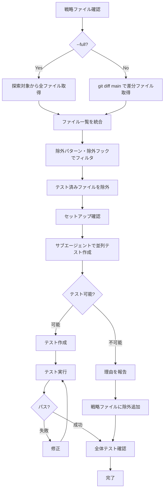

# unit — 単体テストの作成・実行・修正

`/product:test unit` は単体テストを作成し、実行して、パスするまで修正する。対象は 2 種類あり、同じフローで扱う。

- ライブラリ・ユーティリティの関数（`*.ts`）⇒ bun:test で入出力を検証する
- React コンポーネント（`*.tsx`）⇒ bun:test + React Testing Library + happy-dom でレンダリング結果を検証する

メインエージェントは司令塔として動作し、テスト作成の実作業はサブエージェントに委任する。

# 引数

- `--full` — 全探索モード（探索対象ディレクトリ内の全ファイルを対象）
- 引数なし — 差分モード（main ブランチとの差分ファイルのみ対象）

対象を関数だけ・コンポーネントだけに絞りたい場合は依頼時に指定する。指定がなければ両方を対象にする。

# 共通フロー



## 準備: 戦略ファイルを確認

最初に `.claude/strategies/test-unit.md` を確認する。ファイルが存在しない場合は、コードベースを探索して作成する。

戦略ファイルには以下が定義されている。関数とコンポーネントの両方をこの 1 ファイルで扱う。

- 探索対象ディレクトリ（関数側・コンポーネント側それぞれ）
- 除外パターン（テスト不可能だったファイルと理由）
- 除外フック（使用しているとコンポーネントテストが書けないフックの一覧）
- テスト対象外（テストを書かないと決めたファイルと理由）
- 発生した問題（エラー、ワークアラウンド）

## フェーズ1: 対象ファイル一覧を取得

差分モード（デフォルト）では main ブランチとの差分を取る。

```bash
# ライブラリ関数
git diff --name-only main -- '*.ts' | grep -v '\.test\.ts$' | grep -v '\.d\.ts$'

# React コンポーネント
git diff --name-only main -- 'app/components/**/*.tsx' | grep -v '\.test\.tsx$' | grep -v '/ui/'
```

取得したファイルのうち、戦略ファイルの探索対象ディレクトリに含まれるもののみを対象とする。

全探索モード（`--full`）では探索対象ディレクトリから全ファイルを取得する。関数側は探索対象ディレクトリごとにサブエージェント（Explore）を並列起動し、結果を統合する。

```
指定ディレクトリ内の全 .ts ファイルを列挙する。
除外: *.test.ts, *.d.ts, index.ts
結果をファイルパスのリストで返す。
```

コンポーネント側は find で取得する。

```bash
find app/components -name "*.tsx" -not -name "*.test.tsx" -not -path "*/ui/*"
```

## フェーズ2: 除外フィルタ

戦略ファイルの除外パターンに該当するファイルを除外する。

コンポーネント側は、戦略ファイルの除外フックを使用しているコンポーネントも除外する。

```bash
EXCLUDE_HOOKS="useLoaderData\|useParams\|useSearchParams\|useNavigate\|useLocation\|useFetcher\|useMatches"

grep -rl "$EXCLUDE_HOOKS" app/components --include="*.tsx" | grep -v "\.test\.tsx"
```

除外フックの一覧はプロジェクトごとに違う。戦略ファイルに書かれているものを正とする。

既存の `*.test.ts` / `*.test.tsx` を探し、対応するソースファイルをテスト済みとして除外する。

## フェーズ3: セットアップ確認

React コンポーネントを対象に含む場合のみ実施する。ライブラリ関数だけなら bun:test は標準で使えるのでスキップする。

```bash
bun pm ls | grep -E "(testing-library|happy-dom)"
```

未インストールの場合は追加する。

```bash
bun add -D @testing-library/react @testing-library/dom happy-dom
```

`tests/setup-dom.ts` と `bunfig.toml` が存在することを確認する。

## フェーズ4: 並列でテスト作成

残ったファイルごとにサブエージェント（general-purpose）を並列起動する。テスト可否条件とテンプレートは対象の種類で分ける（下記「ライブラリ関数のテスト」「React コンポーネントのテスト」）。

各サブエージェントへの共通指示。

```
ファイル: {ファイルパス}

このファイルを読んでテスト可能か判断する。

テスト可能な場合:
- 同じディレクトリにテストファイルを作成
- テストランナー: bun:test
- テストタイトルは日本語
- 作成したテストファイルのパスを報告

テスト不可能な場合:
- 理由を具体的に報告 (例: "useTranslation Hook を使用している")
- ファイルパスと理由のペアで報告
```

## フェーズ5: 結果の統合

サブエージェントからの報告を集約する。テスト不可能だったファイルと理由を戦略ファイルの除外パターンに追加する。

```markdown
- `ファイル名.ts` - 理由
```

## フェーズ6: テスト実行と修正

対象ディレクトリを指定して実行する。

```bash
bun test <ディレクトリ>
```

失敗したテストがあれば修正する。全テストがパスするまで繰り返す。

## フェーズ7: 全体テスト確認

対象ディレクトリだけでなく全体のテストを実行し、他のテストに影響がないことを確認する。

```bash
bun test
```

よくある問題。

- グローバル環境（window, document）を上書きするテストが他に影響
- `beforeAll` / `afterAll` で環境を保存・復元していない

## 戦略ファイルの更新

テスト作成中に以下を発見したら `.claude/strategies/test-unit.md` を更新する。

- 新しい探索対象ディレクトリ
- 新しい除外フック
- テスト不可能だったファイル・コンポーネントと理由（除外パターンに追加）
- 発生した問題（エラー、ワークアラウンドなど）

# ライブラリ関数のテスト

## テスト可否条件

```
テスト可能な条件:
- 純粋関数である (外部依存なし)
- 入力と出力が明確
- 副作用がない

テスト不可能な条件:
- React Hook (use* で始まる)
- 外部APIを呼び出す
- React/Three.js などのランタイム依存
- Request/Response オブジェクト依存
- 型定義のみ
```

## 作成ルール

- ファイル名: `*.test.ts`
- 同じディレクトリに配置
- 1テスト1アサーション
- 意味のある変数名（省略しない）
- 正常系、境界値、異常系のテストを書く

テストパターン。

- 正常系: 典型的な入力値
- 境界値: 空文字、空配列、0、null、undefined
- 異常系: 不正な入力値、エッジケース

## テンプレート

```typescript
import { expect, test } from "bun:test"
import { targetFunction } from "@/path/to/target-function"

test("正常系: 期待する入力で正しい結果を返す", () => {
  const result = targetFunction({ input: "valid" })
  expect(result).toBe("expected")
})

test("境界値: 空文字を渡すと空文字を返す", () => {
  const result = targetFunction({ input: "" })
  expect(result).toBe("")
})

test("異常系: nullを渡すとデフォルト値を返す", () => {
  const result = targetFunction({ input: null })
  expect(result).toBe("default")
})
```

# React コンポーネントのテスト

## テスト可否条件

```
テスト可能な条件:
- 除外フックを使用していない
- props で動作が制御される
- UIレンダリングが確認できる

テスト不可能な条件:
- 除外フックを使用している
- 外部APIに依存している
- 複雑な状態管理に依存している
```

## 作成ルール

- ファイル名: `*.test.tsx`
- 同じディレクトリに配置
- `bun:test` から `test` と `expect` を使用
- `@testing-library/react` から `render`, `screen` を使用
- 1テスト1アサーション

クエリの優先順位は上から順に使う。

- `getByRole` — アクセシビリティロール
- `getByLabelText` — フォーム要素
- `getByText` — テキストコンテンツ
- `getByTestId` — 最終手段

## テンプレート

```typescript
import { expect, test } from "bun:test"
import { render, screen } from "@testing-library/react"
import { Button } from "./button"

test("正常系: デフォルトのボタンをレンダリングする", () => {
  render(<Button>Click me</Button>)
  const button = screen.getByRole("button", { name: "Click me" })
  expect(button).toBeDefined()
})

test("正常系: variant=orange でスタイルが適用される", () => {
  render(<Button variant="orange">Submit</Button>)
  const button = screen.getByRole("button")
  expect(button.className).toContain("bg-orange")
})

test("正常系: disabled 属性が適用される", () => {
  render(<Button disabled>Disabled</Button>)
  const button = screen.getByRole("button")
  expect(button.hasAttribute("disabled")).toBe(true)
})
```

## Link を含むコンポーネント

react-router の `Link` を使用するコンポーネントは `MemoryRouter` でラップする。

```typescript
import { MemoryRouter } from "react-router"

test("正常系: リンクがレンダリングされる", () => {
  render(
    <MemoryRouter>
      <DocLink href="/test">リンク</DocLink>
    </MemoryRouter>
  )
  expect(screen.getByRole("link")).toBeDefined()
})
```
